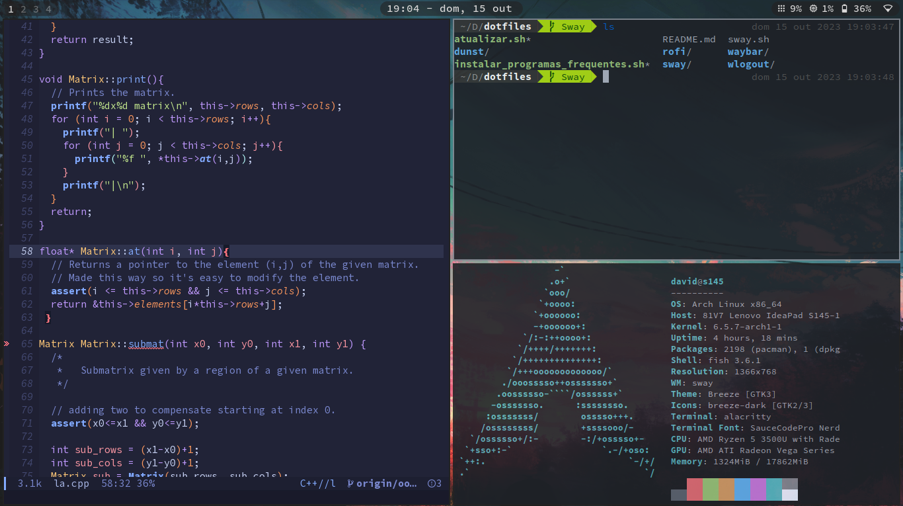

# Dot Files
Repositório de configurações para alguns programas que uso frequentemente. Esta branch possui meus arquivos de configuração para o Swaywm.

# Aparência
<p align="center" width="100%"></p>

## Atualizar arquivos de configuração 

```shell
./atualizar.sh
```

## Instalar programas frequentemente usados

``` shell
./instalar_programas.sh
```
